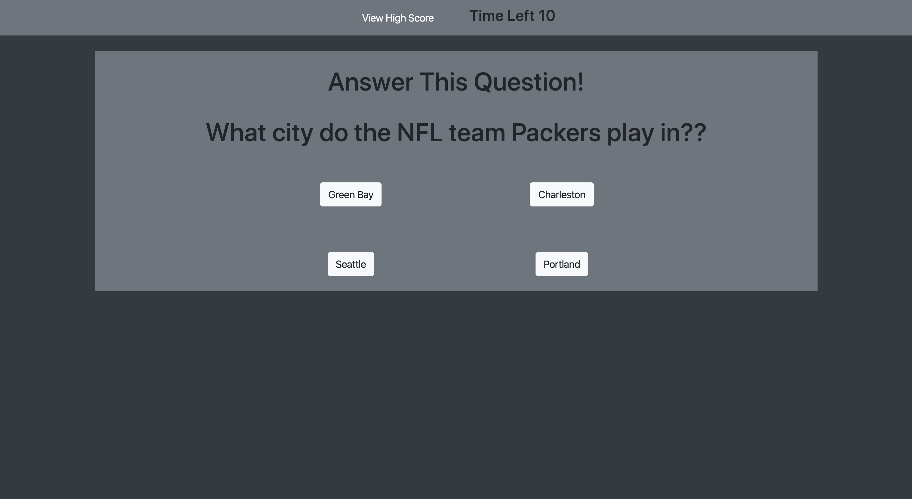
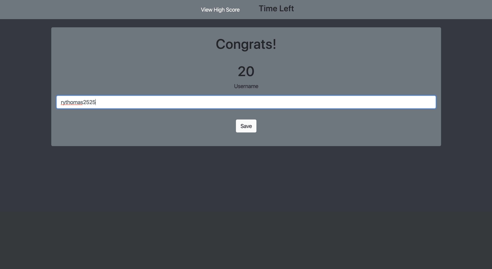
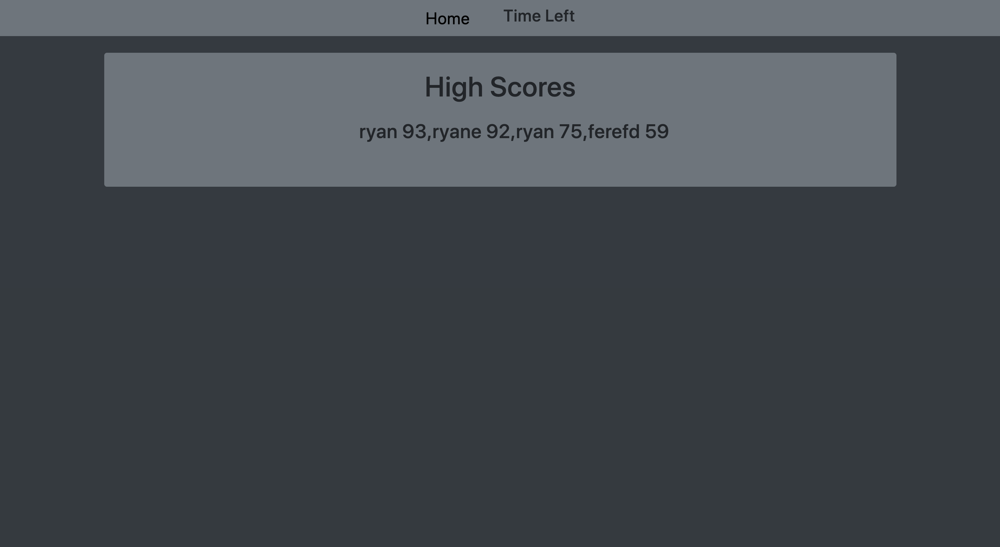

# Sports Quiz

Here is my short quiz based on Sports teams locations. I used a mixture of HTML, .CSS (both in-line and w/Bootstrap), & Javascript. For the javascript I used a mixture of using a seperate sourced .js files  and putting .js at the bottom of the html page.   

##  Links
Git Pages
https://rythomas2525.github.io/quiz/
Git Hub Repository
https://github.com/rythomas2525/quiz
My Portfolio w/ project attached
https://rythomas2525.github.io/hw2responsiveportfolio/

## Screenshots

## Developed by Ryan Thomas

